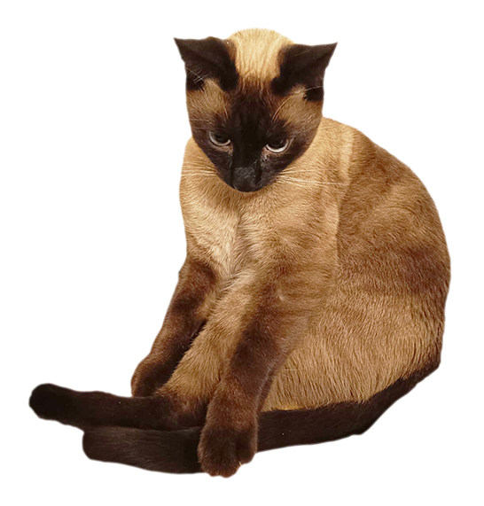

# audio-plugins-dev

This repository is intended to be my journey through Audio Plugins development using the JUCE framework. I hope it helps
you too!

## Plugin Projects

- [ ] **Gain Plugin.** Currently working on this one. It's based on my friend and fellow artist Adriana Proenza's cat (
  Coco). We need some name ideas, this is what we have so far:
    - Coco Gain
    - Coconut Gain
    - French Gain
    - French Coco
    - Coco Loco Gain

- [ ] **"Huh?" cat delay**

> [!IMPORTANT]
> Owner must be contacted first.

- [ ] **Spinning cat modulator, maybe a chorus? Or even just a Leslie speaker effect?**

> [!IMPORTANT]
> Maxwell's owner must be contacted first.

